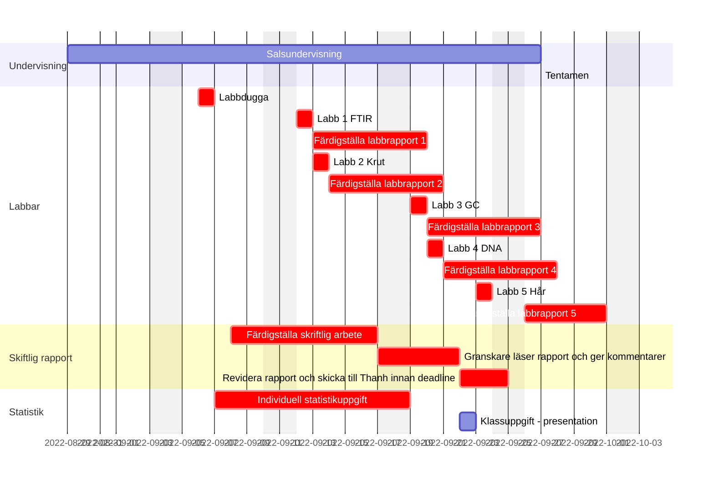

---
# An instance of the Blank widget.
# Documentation: https://sourcethemes.com/academic/docs/page-builder/
widget: blank

# Activate this widget? true/false
active: true

# tags
tags:
- Laboration
- Gantt
- Projektarbete
- Rapport
- Praktiska moment
- Statistik

diagram: true
math: true

# This file represents a page section.
headless: true

# Order that this section appears on the page.
weight: 1

title: Kursinnehåll

design:
  columns: "1"
  spacing:
    padding: ["20px", "0", "20px", "0"]

# Use https://mermaid-js.github.io/mermaid-live-editor/ to modify mermaid gantt
# A red vertical line will be shown to mark "today"

---

# Kursens upplägg

Analysvetenskap och forensik är ett multidisciplinärt område som förutom kemi även innefattar biologi, juridik, statistik och presentationsteknik. Analytiska mätningar för att identifiera kemiska ämnen samt kvantifiera mängder av dessa och är essentiellt för analysvetenskap och att säkerställa att mätningarna har gått rätt till är viktigt inom forensiken. Målet med denna kurs ___Introduktion till analysvetenskap och forensik___ är att ge en förhandsvisning om vilka viktiga vetenskapsområde som programmet kommer att behandla. 

- Grundläggande kemi
- Analytisk kemi
- Biokemi
- Biologi
- Statistik
- Teknisk rapportskrivning

 

# Ganttschema med datum för varje kursmoment inom introduktionskursen
 

Uppdaterade datum för varje kursmoment finns i Kronox: https://kronox.oru.se/ (sök på kurskoden KE201G).  
Rödmarkerade är obligatoriska moment inom kursen.

_Vill du veta mer om vad Ganttschema är? Se [här](https://sv.wikipedia.org/wiki/Gantt-schema)_
   