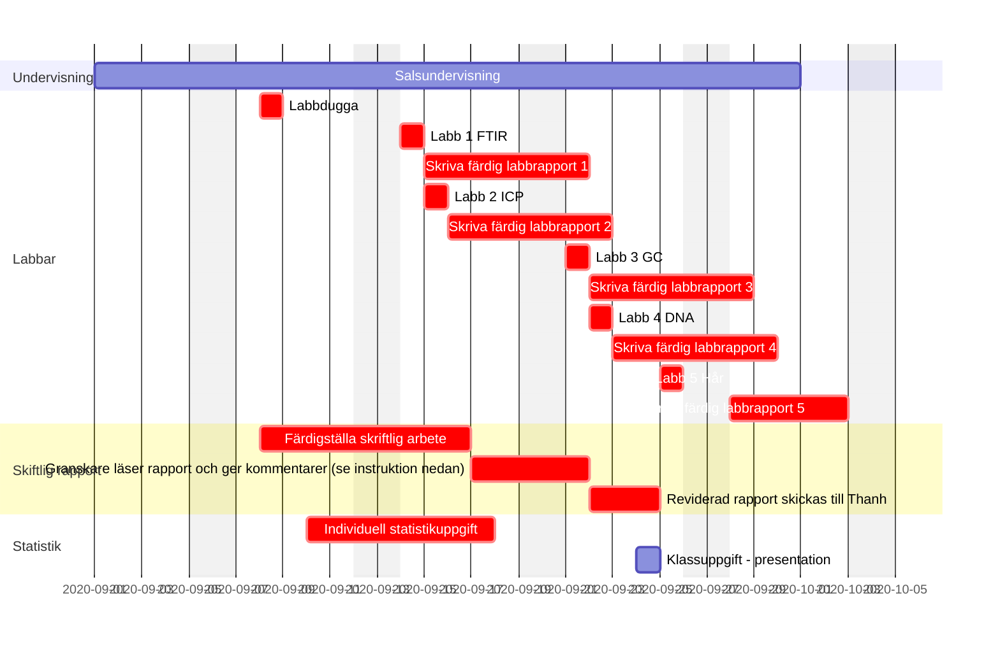

---
# An instance of the Blank widget.
# Documentation: https://sourcethemes.com/academic/docs/page-builder/
widget: blank

# Activate this widget? true/false
active: true

# tags
tags:
- laboration
- schema
- projekt

diagram: true
math: true

# This file represents a page section.
headless: true

# Order that this section appears on the page.
weight: 1

title: Ganttschema med överblick över kursmoment

design:
  columns: "1"
  spacing:
    padding: ["20px", "0", "20px", "0"]

## Use https://mermaid-js.github.io/mermaid-live-editor/ to modify mermaid gantt
---

Exakta datum för varje kursmoment finns i Kronox: https://kronox.oru.se/ (sök på kurskoden KE201G).  
Rödmarkerade är obligatoriska moment inom kursen.

Vill du veta mer om Ganttschema? Klicka [här](https://sv.wikipedia.org/wiki/Gantt-schema)
 