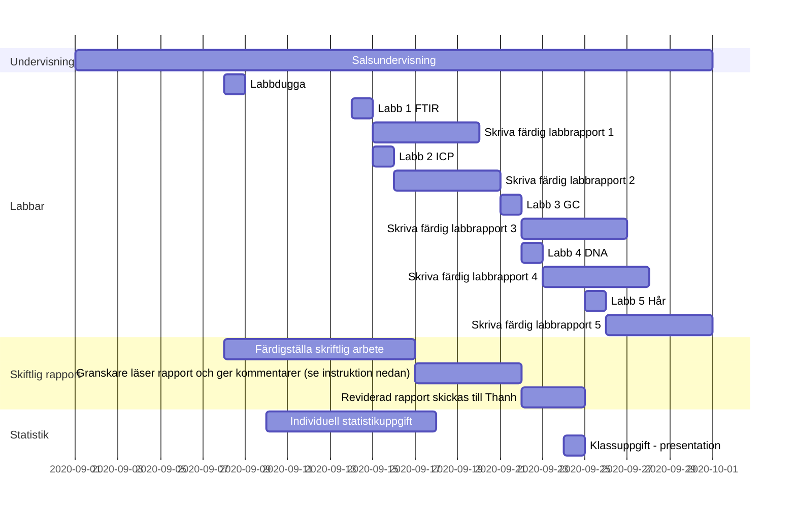

---
# An instance of the Blank widget.
# Documentation: https://sourcethemes.com/academic/docs/page-builder/
widget: blank

# Activate this widget? true/false
active: true

diagram: true
math: true

# This file represents a page section.
headless: true

# Order that this section appears on the page.
weight: 2

title: Ganttschema med överblick över kursmoment

design:
  columns: "1"
  spacing:
    padding: ["20px", "0", "20px", "0"]
---

