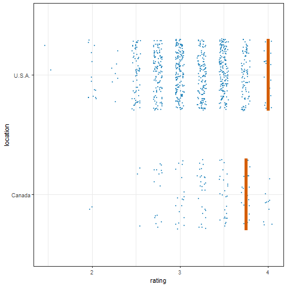

```{r startup}

library(shiny)
library(widgetframe)
```


```{r}

library(leaflet)
library(leaflet.extras)
library(tidyverse)
library(gganimate)
library(ungeviz)
library(plotly)


m <- leaflet() %>%
  addTiles() %>%  # Add default OpenStreetMap map tiles
  addMarkers(lng=174.768, lat=-36.852, popup="The birthplace of R")
m  # Print the map

```


plotly
```{r plotly, echo=FALSE, warning=FALSE}

library(plotly)
plot_ly(data = iris, x = ~Sepal.Length, y = ~Petal.Length)

```


Shiny
<iframe height="1000" width="100%" frameborder="no" src="https://wbs-tw.shinyapps.io/CPquant-Shiny/"> </iframe>


Paste Ungeviz gif



